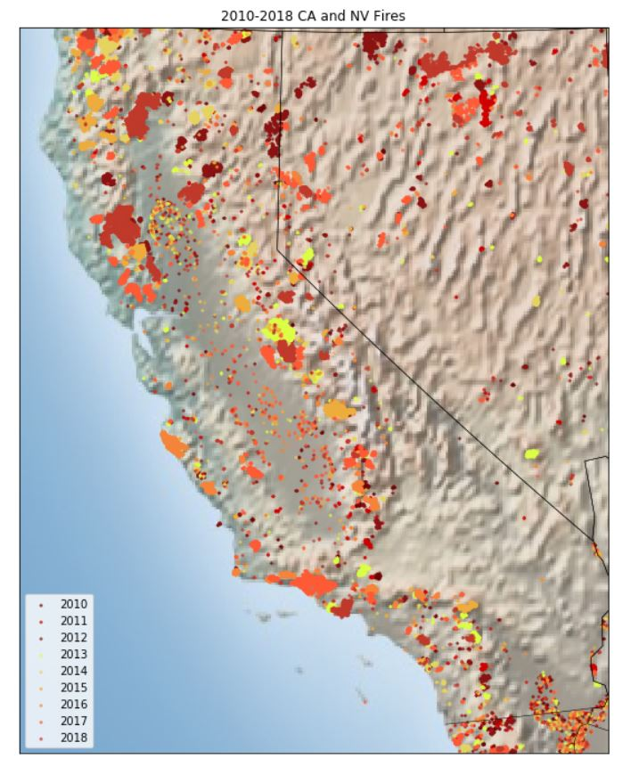
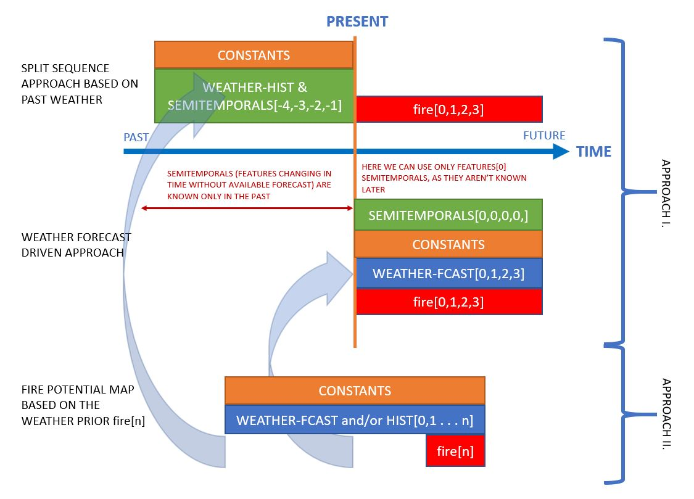
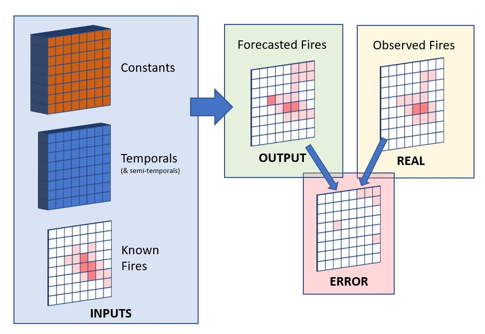
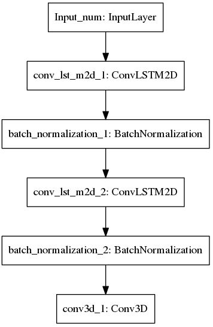
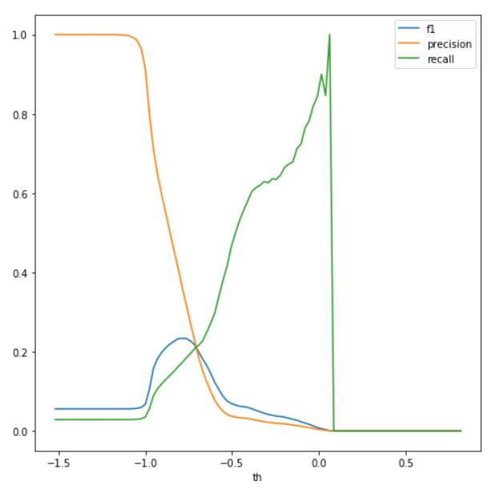
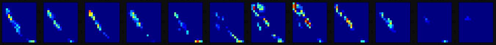
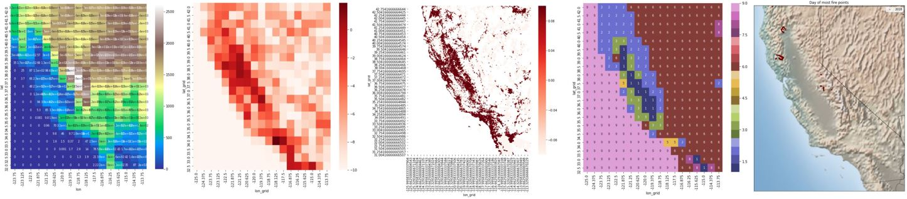
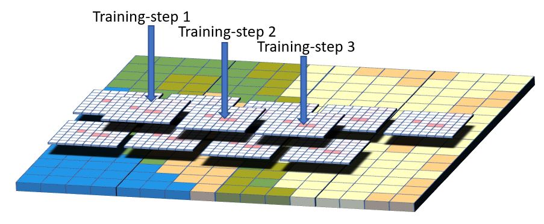

# Call for Code 2019: Fire Forecasting

### Problem Description

In the US, over the past decade, there have been an average of 66 thousand fires annually, with Federal fire suppression costs totaling over \$18 billion for the decade <cite>[(NIFC, 2019)][1]</cite>. Over 69 million acres have been burned, sometimes resulting in property damage, injury, and even death. According to the National Fire Protection Association’s Fire Loss report for the US in 2017 alone, property damage was estimated at \$23 billion, including \$10 billion in losses from wildfires in Northern California <cite>[(NFPA, 2018)][2]</cite>. 

### Forecasting Fires - Why is it important?

Fire forecasts and danger ratings “...provide quantification of risk elements that are critical for daily decisions regarding firefighter resource placement, staffing levels, appropriate suppression response, and strategic decisions at local, regional, and national levels.” <cite>[(NWCG, 2019)][3]</cite>. With advance notice, agencies will be able to prepare and mobilize more quickly; fighting fires in their early stages might lead to a reduction in fire spread and therefore, damage. Most importantly, this could prevent injury and death. In 2017 there were over 14 thousand injuries and over 3 thousand deaths due to fire <cite>[(USFA, n.d.)][4]</cite>. 

### Previous Work

One of the current fire forecasting products in use in the US is the 7-Day Significant Fire Potential Product. Per the Geographic Area Coordination Centers <cite>[(GACC, n.d.)][5]</cite>:

> The product is based on a statistical model which uses fuel moisture inputs from the NFDRS (WIMS) and various gridded weather inputs from weather models. This data is processed through a series of equations that yield forecasts of Fuel Dryness Level (DL) as well as probabilities (some objective and some subjective) of certain critical weather conditions for each of the next 7 days. When appropriate combinations of DL and weather triggers are expected, a “**High Risk Day**” is designated on the Chart to warn of a significantly higher than normal chance for a “Large Fire”.

### Solution

We seek to improve upon these models by removing some of the subjectivity and direct human involvement through the use of deep learning algorithms and remotely sensed data. Our goal is to develop a model to forecast the number of fires in an area, given ambient weather conditions, as well as some constant features like elevation, population density, etc. The working demo spatial grid covers the broader California region, but the solution can be easily scaled and used for any territory.

The other goal of the project was to develop a system of near-real-time (NRT) monitoring of forest and grass fires based on satellite observations.

During development, we explored different input data combinations, Deep Learning model architectures, and different time-frames.

We developed models to estimate fire presence and spread in the grid cells, or areas. We trained the models on observed fire counts, and we consider our outputs as the fire density of the grid, and we assumed that this output value is proportional with the fire danger and fire probability in the grid cells. 

The grid cell dimension we used for the demo is approximately 50 km, and we didn’t try to forecast the horizontal translocation of fires because our demo scale is too large for that. But the horizontal fire spread modeling based on the data can also be explored as the further work on the project.

Main approaches:

Approach I:
Based on the last known fires we built models to forecast how the fire count in the cell will change over time and to see if in other cells new fires develop.

For this approach, we built two types of models. The first one is based on the earlier fires and earlier weather information (fig: split-sequence approach based on past weather). Based on this data the model estimates the fire counts in the cells for the next days. The advantage of this model that it needs only prior data, but it can’t handle future weather changes.

The other model is weather forecast driven. From the last state of fires, it predicts future fire development. This model can be sensitive to wrong weather forecasts.

Approach II:
The second main approach doesn’t forecast the existing fires but shows the area with the largest potential for new fires. (fig: fire potential map based on the weather prior). This model isn’t a simple statistical model of the training period, but it also considers the 30 days weather prior to the estimated day. This can be used with historical weather data, numerical forecast, or combined. This model gives back a map, where we can see the relative potential of fires. We used the outputs of this model as an input feature of the above-described models.

  
_Simplified dataflow of our models in Approach I._

### Metric

For our metric, we used [F1 Score](https://en.wikipedia.org/wiki/F1_score), [precision and recall](https://en.wikipedia.org/wiki/Precision_and_recall). For our baselines, we used scores from the following naive predictions:

1. No fires [Fscore: 0.493, Precision: 0.485, Recall: 0.500]

2. The average of the previous 2 days fire count [Fscore: 0.632, Precision: 0.611, Recall: 0.686]

3. The average of the previous 24 hours fire count [Fscore: 0.737, Precision: 0.729, Recall: 0.770]

4. The average of the previous 12 hours fire count [Fscore: 0.755, Precision: 0.767, Recall: 0.764]

### Results

During experimenting, we tried out different architectures of mixed convolutional LSTM, encoder-decoder and convolutional layers. So far the best results for Approach I. we got from the below simple 2 steps convolutional LSTM and one step convolutional network.

Our outputs are continuous numbers, but to decide the best model for the demo we used precision, recall, and f1-score, and our scores were based on fire existence. Our main ranking score was f1-score.

Fires are rare compared to areas without fires. This lead to a dataset, where most of the fire counts are zeros, and only 2-3 percent of the fire data is non zero. Large proportion of the fiery cells contains only 1-2 fires, which is close to zero. To help the model to learn the difference between fiery and non-fiery cells, we tried to separate the fire and non-fire cases by replacing the non-fiery zero values by negative numbers. -1 for non-fiery cells gave better results than zero, but to find better separation needs further research.

 
_Precision, recall, f1-score with different fire existence separation thresholds._

Because of the large proportion of non-fiery cells, we anticipated that the model output is biased. So instead of considering a cell fiery when the model forecasts a number greater than zero, we experimented with other numbers. To find the best threshold for fire/non-fire separation we checked the meaningful thresholds, and choose the one with best f1-score from validation data. This method didn’t significantly alter the scores of test data, but with larger datasets later can be useful.

With our second main approach, we managed to build a model which was able to catch the seasonality of the fires but considered the effect of the past 30 days weather. We hope, that inputting this results back to our models which forecasts actual fires we can get better results. With this approach, the model didn’t know the existing fires, so it shows the cells with the best conditions for possible fires based on the prior 30 days data. To retrieve the information from these predictions the earlier described thresholding method was necessary because almost all of the predicted values were below zero. We had to find the best separator of non-fiery and fiery cells and based on that threshold we got the maps below.

 
_The boxes show the calculated fire potential of a day in every month in 2018._

 
_2018 Fire potential, fire and weather. In august the model forecasts well the north-eastern region will be more fiery._

### Data

For our training, validation and test data, we considered an area which includes the states of California and Nevada, as there have been numerous large wildfires in CA in recent years which have caused injury and significant property damage. However, our data comes from near-real-time global NASA datasets, and our solution could be applied globally with only the model needing to be trained on the regional data. 

Our dataset consists of different NASA data collections, including active fire, weather, elevation, landcover, population, and vegetation data.  Our data spans 9 years (2010-2019). The temporal and spatial resolution varies between datasets, but we have aggregated and resampled the time series data to be on 12hour frequency and each cell in our spatial grid is roughly 50km2.

 
_Some of our used datatypes on map: elevation, poplulation (grid and high-res), landcover types, fire._

##### Data Sources

1. [Fire Information Resource Management System (FIRMS)](https://doi.org/10.7927/H49C6VHW).  _Fire Information For Resource Management System (FIRMS) distributes Near Real-Time (NRT) active fire data within 3 hours of satellite observation from both the Moderate Resolution Imaging Spectroradiometer (MODIS) and the Visible Infrared Imaging Radiometer Suite (VIIRS)._ We used MODIS because VIIRS data only spans from 2012 to present.
2. [Modern-Era Retrospective analysis for Research and Applications, Version 2 (MERRA 2)](https://gmao.gsfc.nasa.gov/reanalysis/MERRA-2/) _(MERRA-2) provides data beginning in 1980 and enables assimilation of modern hyperspectral radiance and microwave observations, along with GPS-Radio Occultation datasets. It also uses NASA's ozone profile observations that began in late 2004. Spatial resolution is about 50 km in the latitudinal direction._
3. [Land Cover CCI Climate Research Data Package](http://maps.elie.ucl.ac.be/CCI/viewer/download.php) _Global [land cover] maps at 300m spatial resolution._ Updated annually.
4. [Gridded Population of the World V.4](https://sedac.ciesin.columbia.edu/data/set/gpw-v4-population-density-rev11). _Population Density. Estimates of human population density (# of persons/square km) based on counts consistent with national consensuses and population registers_. 30 arc-second resolution (~1km)
5. [MODIS Vegetation Indices](https://modis.gsfc.nasa.gov/data/dataprod/mod13.php) _MODIS vegetation indices, produced on 16-day intervals at 1km spatial resolution, provide consistent spatial and temporal comparisons of vegetation canopy greenness, a composite property of leaf area, chlorophyll and canopy structure._ In some cases, [vegetation indices have be used to estimate fuel moisture content](https://www.sciencedirect.com/science/article/abs/pii/S0034425704001531), one of the most important factors in fire ignition and spread.

### Future Work

Due to the size of our dataset, and the limitations of the machines we were training on, we were unable to use a higher temporal and spatial resolution. We believe that with higher resolution, our model's predictive power would be greatly enhanced. Preliminary runs at a 3hr resolution show [ discuss specific scores here ] , which is a [ specific score ] improvement over the 12hr resolution. 

Access to larger machines would also allow us to produce a longer-range forecast. With our current architecture, our features include not only those from the current time-step, but also those from the previous _N_ time-steps, where _N_ is equal to the number of time-steps we wish to forecast. This is very expensive, and we were limited to forecasting only 2 days. Even with a 2 day forecast, we were able to achieve [ discuss specific scores here ] , which is a [ specific  ]% improvement over the baseline 2 day forecast of [Fscore: 0.632, Precision: 0.611, Recall: 0.686]. With an extended forecast, fire agencies could better prepare themselves and advise the community in times of increased fire danger. 

We'd like to consult domain experts to further explore features which might improve our scores, such as using forecasted weather. Currently we're using historical weather data, and weather at the time of prediction to make our forecast. However, as weather is one of the major factors in fire ignition and spread, we believe that using forecasted weather for each time-step in our prediction would result in more accurate predictions, particularly when combined with a higher temporal and spatial resolution.

In the future, we would like to use higher resolution data and new surface features to be able to forecast the direction and speed of fires. From our ~50 km resolution, we would like to go to some hundred meters as lots of satellite data enable us to build this high-resolution dataset. We couldn’t train the whole area at once in one model because of the size of the data, only a part of it. But this way our prediction model would be more independent of specific places, and more dependent on the features of the environment. To train this model we plan to divide the forecast region to overlapping smaller areas and train the model on them. This way the trained model could be used on existing fires to forecast the movement of that fires.

We want to improve the satellite-based fire observation. Our goal is to make a system, that is able to distinguish new fires from earlier existing fires. The problem is that the exact coordinate of the same fire can be different from observation to observation as the fire moves a bit, thick clouds can cover the area, or there can be small errors of measurement. Because of these factors, it is hard to tell visually from one observation to the other if the coordinate is a new fire, or only the earlier fires hot-point shifted a bit, or last time the fire wasn't visible because of the weather. To address this we want to introduce a filtering system. This is going to be a combination of a spatial and time distance filter. For example, we can set the minimum threshold for spatial distance, and the system will show a coordinate as new fire, only if it is further away from all earlier fires than the threshold. We can combine this with a minimum and maximum time threshold. This way if a fire wasn't visible for one or two observations because of the weather we can compare it to a last known location. Of course only up to the maximum time threshold. The thresholds will start with default values but will be changeable for more experienced users.

### Credits and Thanks

First, we'd like to thank IBM for access to [ list IBM products/services used here ] and for the opportunity to compete in this challenge. It has been an inspiring and exciting experience for us. We would love to see our work applied to help mitigate damage and injury. 

We'd also like to thank NASA and those involved in funding the collection of, and curating the datasets we have used. This would not be possible without you, so thank you! 

### Authors

*

*

Istvan Veber 
https://github.com/sinusgamma 
https://www.linkedin.com/in/istvanveber/ 

### License

[1]: https://www.nifc.gov/fireInfo/fireInfo_documents/SuppCosts.pdf
[2]:https://www.nfpa.org/News-and-Research/Data-research-and-tools/US-Fire-Problem/Fire-loss-in-the-United-States
[3]: https://www.nwcg.gov/sites/default/files/publications/pms426-3.pdf
[4]: https://www.usfa.fema.gov/data/statistics/
[5]: https://gacc.nifc.gov/oncc/predictive/weather/Fire%20Potential%20Documentation.htm
[6]: https://en.wikipedia.org/wiki/F1_score
[7]: https://en.wikipedia.org/wiki/Precision_and_recall

