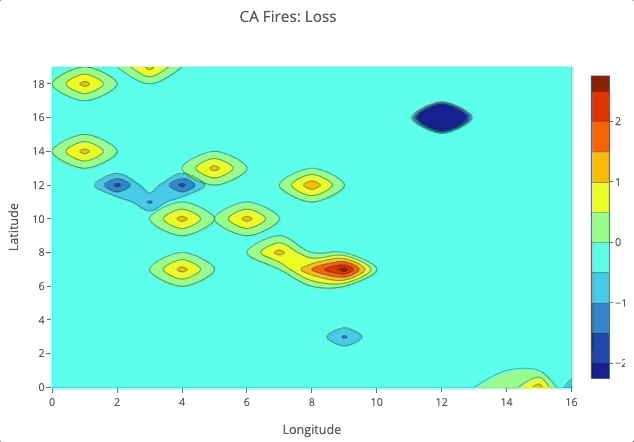
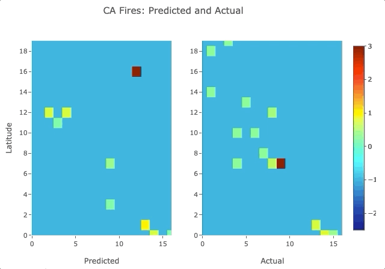

# Call for Code 2019: Fire Forecasting

### Problem Description

In the US, over the past decade, there have been an average of 66 thousand fires annually, with Federal fire suppression costs totaling over \$18 billion for the decade <cite>[(NIFC, 2019)][1]</cite>. Over 69 million acres have been burned, sometimes resulting in property damage, injury, and even death. According to the National Fire Protection Association’s Fire Loss report for the US in 2017 alone, property damage was estimated at \$23 billion, including \$10 billion in losses from wildfires in Northern California <cite>[(NFPA, 2018)][2]</cite>. 

### Forecasting Fires - Why is it important?

Fire forecasts and danger ratings “...provide quantification of risk elements that are critical for daily decisions regarding firefighter resource placement, staffing levels, appropriate suppression response, and strategic decisions at local, regional, and national levels.” <cite>[(NWCG, 2019)][3]</cite>. With advance notice, agencies will be able to prepare and mobilize more quickly; fighting fires in their early stages might lead to a reduction in fire spread and therefore, damage. Most importantly, this could prevent injury and death. In 2017 there were over 14 thousand injuries and over 3 thousand deaths due to fire <cite>[(USFA, n.d.)][4]</cite>. 

### Previous Work

One of the current fire forecasting products in use in the US is the 7-Day Significant Fire Potential Product. Per the Geographic Area Coordination Centers <cite>[(GACC, n.d.)][5]</cite>:

> The product is based on a statistical model which uses fuel moisture inputs from the NFDRS (WIMS) and various gridded weather inputs from weather models. This data is processed through a series of equations that yield forecasts of Fuel Dryness Level (DL) as well as probabilities (some objective and some subjective) of certain critical weather conditions for each of the next 7 days. When appropriate combinations of DL and weather triggers are expected, a “**High Risk Day**” is designated on the Chart to warn of a significantly higher than normal chance for a “Large Fire”.

### Solution

We seek to improve upon these models by removing some of the subjectivity and direct human involvement through the use of deep learning algorithms and remotely sensed data. Our goal is to develop a model to forecast the number of fires in an area, given ambient weather conditions, as well as some constant features like elevation, population density, etc. 

### Description

For our training, validation and test set, we considered the state of California, as there have been numerous large wildfires in recent years which have caused injury and significant property damage. However, our data comes from near-real-time global NASA datasets, and our solution could be applied globally with only the model needing to be trained on the regional data. There is a possibility that transferring pretained model weights might be effective in reducing the training time when modeling a new region, though this hasn't been tested.

#### Data

#### Architecture

#### Metric

For our metric, we used [F1 Score](https://en.wikipedia.org/wiki/F1_score), [precision and recall](https://en.wikipedia.org/wiki/Precision_and_recall). For our baselines, we used scores from the following naive predictions:

1. No fires [Fscore: 0.493, Precision: 0.485, Recall: 0.500]

2. The average of the previous 2 days fire count [Fscore: 0.632, Precision: 0.611, Recall: 0.686]

3. The average of the previous 24 hours fire count [Fscore: 0.737, Precision: 0.729, Recall: 0.770]

4. The average of the previous 12 hours fire count [Fscore: 0.755, Precision: 0.767, Recall: 0.764]

   

### Results

### Future Work

[1]: https://www.nifc.gov/fireInfo/fireInfo_documents/SuppCosts.pdf
[2]:https://www.nfpa.org/News-and-Research/Data-research-and-tools/US-Fire-Problem/Fire-loss-in-the-United-States
[3]: https://www.nwcg.gov/sites/default/files/publications/pms426-3.pdf
[4]: https://www.usfa.fema.gov/data/statistics/
[5]: https://gacc.nifc.gov/oncc/predictive/weather/Fire%20Potential%20Documentation.htm
[6]: https://en.wikipedia.org/wiki/F1_score
[7]: https://en.wikipedia.org/wiki/Precision_and_recall

